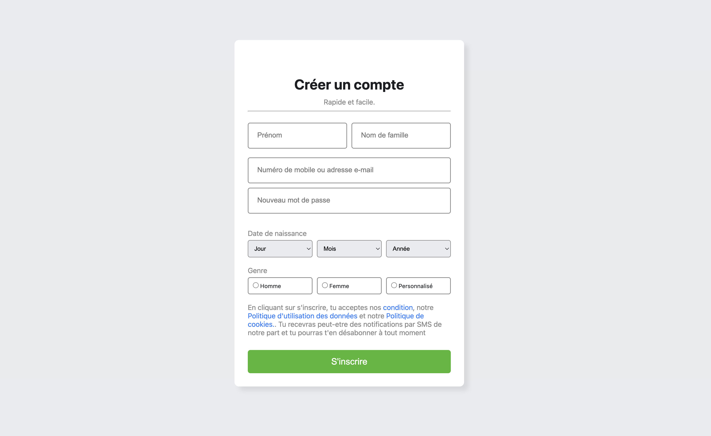
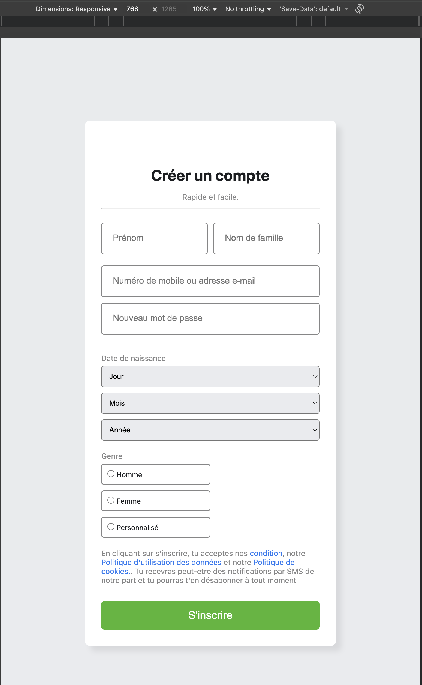

# Description
## Facebook SignUp Page
Ce projet consiste à réaliser une page d'inscription inspirée de Facebook en utilisant uniquement HTML et CSS. L'objectif est de reproduire l'interface utilisateur de la page d'inscription de Facebook, en mettant l'accent sur la structure sémantique, l'accessibilité et le design responsive.

Structuration du formulaire d'inscription avec des champs pour le prénom, le nom, l'email ou le numéro de téléphone, le mot de passe, la date de naissance et le genre.
Respect des bonnes pratiques d'accessibilité (labels, aria-labels, etc.).
Utilisation de styles CSS pour obtenir une interface moderne et agréable à utiliser.
Adaptation de la page pour différents supports (ordinateurs, tablettes, mobiles).
Ajout d'informations légales et de liens vers les conditions d'utilisation, la politique de confidentialité et la politique de cookies.
Ce projet permet de s'entraîner à l'intégration web et de se familiariser avec la création de formulaires complexes et accessibles.
---
## Objectifs
- Découvrir la structure de base d’une page HTML
- Utiliser les balises HTML sémantiques
- Appliquer des styles CSS : Lier une feuille de style externe et personnaliser l’apparence de la page.
- Responsive design pour adapter la page aux différents écrans.
- Structurer et organiser son code séparez le contenu (HTML) et la présentation (CSS).
## Fonctionnalités

- Design centré sur le centre de la page
- Responsive (ordinateur, tablette et mobile)
-  interactifs avec effet hover et focus
- Structure HTML sémantique et code CSS organisé
- Flexbox pour une bonne structure

## Technologies utilisées

- HTML5
- CSS3

## Responsivité

- Ordinateur : une colonnes horizontal
- Tablette et Mobile : colonnes empilées verticalement
- Textes centrés et adaptés aux petits écrans
- input de type texte, email, mot de passe, radio et select

## Structure du projet

### Facebook SignUp Page
- index.html
- style.css 
- README.md 

